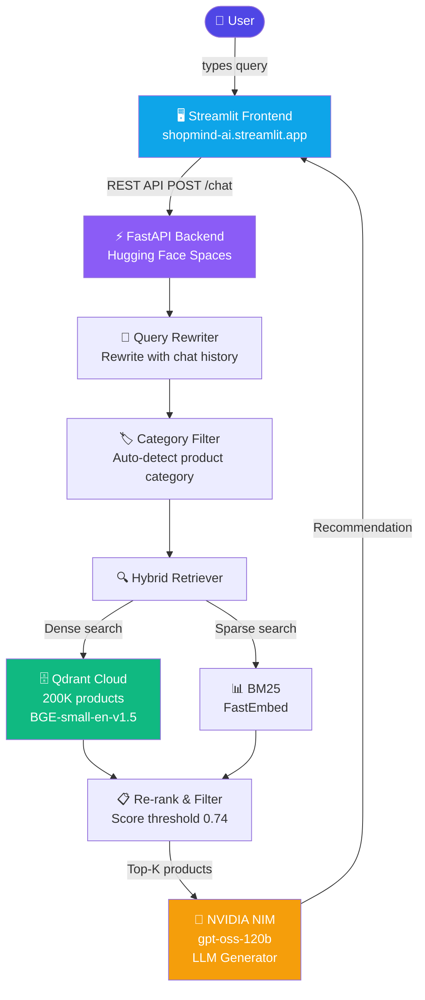

# 🛒 ShopMind — AI-Powered E-Commerce Recommendation System

> Conversational product recommendations using Retrieval-Augmented Generation (RAG), NVIDIA NIM, and Qdrant vector search.

🔗 **Live Demo:** [shopmind-ai.streamlit.app](https://shopmind-ai.streamlit.app)  
🔗 **API Docs:** [saix11-shopmind-api.hf.space/docs](https://saix11-shopmind-api.hf.space/docs)

---

## Architecture



---

## Tech Stack

| Component | Technology |
|---|---|
| **Frontend** | Streamlit |
| **Backend** | FastAPI + Uvicorn |
| **Vector DB** | Qdrant Cloud |
| **Embeddings** | BGE-small-en-v1.5 (sentence-transformers) |
| **LLM** | NVIDIA NIM — gpt-oss-120b |
| **Sparse Retrieval** | FastEmbed BM25 |
| **Evaluation** | RAGAS |
| **Deployment** | Hugging Face Spaces + Streamlit Cloud |

---

## RAGAS Evaluation Results

Evaluated on 92 test samples across the product catalog.

| Metric | Score |
|---|---|
| **Faithfulness** | 0.519 |
| **Answer Relevancy** | 0.854 |
| **Context Precision** | 0.326 |
| **Context Recall** | 0.348 |
| **Overall (avg)** | **0.512** |

---

## Key Features

- **Conversational Memory** — remembers previous turns, rewrites queries in context
- **Category-Aware Filtering** — maps user intent to product categories automatically
- **Hybrid Retrieval** — dense (BGE embeddings) + sparse (BM25) search
- **Price & Rating Filters** — extracted directly from natural language queries
- **Greeting Detection** — handles non-product queries gracefully
- **200,000 Products** — across 25 electronics categories, 1999+ brands

---

## Project Structure

```
ShopMind/
├── data_preparation.py      # Data cleaning + preprocessing
├── embed_and_index.py       # Embed + index into Qdrant
├── rag_pipeline.py          # Core RAG retrieval + generation
├── conversational_rag.py    # Multi-turn conversation handling
├── hybrid_index.py          # BM25 sparse index
├── evaluation.py            # Basic evaluation
├── ragas_evaluation.py      # RAGAS metrics evaluation
├── api.py                   # FastAPI backend
├── streamlit_app.py         # Streamlit frontend
├── Dockerfile               # HuggingFace Spaces deployment
├── render.yaml              # Render deployment config
└── requirements.txt
```

---

## Local Setup

```bash
# Clone repo
git clone https://github.com/saikatsam11/ShopMind.git
cd ShopMind

# Create virtual environment
python -m venv venv
venv\Scripts\activate

# Install dependencies
pip install -r requirements.txt

# Set environment variables
cp .env.example .env
# Add your NVIDIA_API_KEY, QDRANT_URL, QDRANT_API_KEY

# Run FastAPI backend
uvicorn api:app --reload --port 8000

# Run Streamlit frontend (new terminal)
streamlit run streamlit_app.py
```

---

## Dataset

**Amazon Reviews 2023** — [amazon-reviews-2023.github.io](https://amazon-reviews-2023.github.io/)

200,000 electronics products preprocessed from Amazon product listings across 25 categories including Computers, Camera & Photo, Cell Phones, Home Audio, and more.
